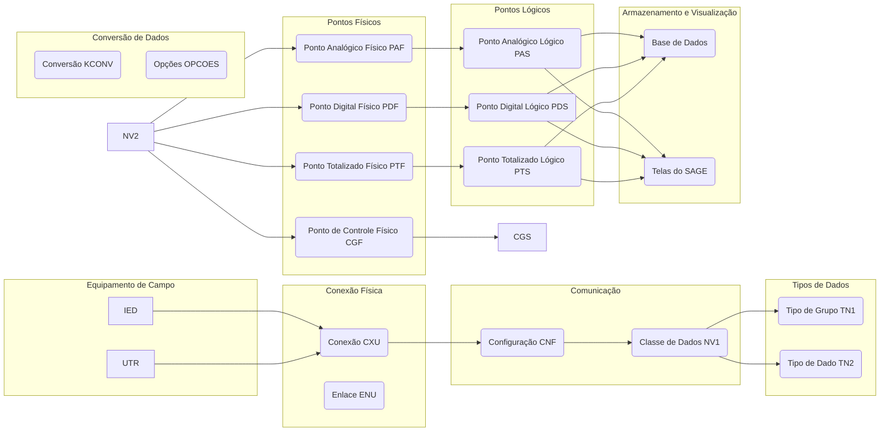

**Usuário**: como funciona o modelo de aquisição de dados? você consegue fazer um diagrama usando mermaid mostrando as tabelas e relações?

---

**Assistente**: O modelo de aquisição de dados do SAGE funciona em etapas, relacionando diversos componentes para obter os valores dos pontos medidos pelos equipamentos de campo:

- **Equipamento de campo:** Os IEDs e UTRs coletam dados em tempo real do sistema elétrico, como tensão, corrente, estado de disjuntores, etc. Esses dados são organizados em datasets de acordo com o protocolo de comunicação.

- **Conexão física:** Os IEDs e UTRs se conectam ao sistema SAGE local através de conexões físicas. Essas conexões são configuradas na tabela CXU e podem ser redundantes, usando dois canais de comunicação ENU.

- **Configuração da comunicação:** Cada conexão física e cada UTR ou IED (se redundante) são configurados individualmente em uma tabela CNF. Essa configuração define o protocolo de comunicação, parâmetros de comunicação, e as classes de dados que serão lidas.

- **Classes de dados:** As classes de dados são configuradas na tabela NV1. Cada CNF pode ter múltiplas classes de dados (NV1) para diferentes tipos de dados (analógico, digital, totalizado, etc.). A tabela CNF define a relação 1:N com a tabela NV1.

- **Tipos de dados:** A tabela TN1 define o tipo de grupo (aquisição, controle, etc.) para a tabela NV1, e a tabela TN2 define o tipo de dado (analógico, digital, etc.). A tabela NV1 define a relação 1:N com a tabela TN1, e a tabela NV2 define a relação 1:N com a tabela TN2.

- **Pontos físicos:** Os pontos físicos são configurados na tabela PAF, PDF, PTF e CGF. Cada ponto físico está associado a um tipo de dado (NV2) e tem um identificador único que define o endereço do ponto no equipamento. A tabela NV2 define a relação 1:N com a tabela PAF, PDF, PTF, e CGF.

- **Conversão de dados:** Os valores dos pontos físicos são convertidos para unidades de engenharia (kV, A, MW, etc.) e são aplicados filtros de razoabilidade. A conversão é definida pelos atributos KCONV e OPCOES da tabela PAF, PDF, PTF, e CGF.

- **Pontos lógicos:** Os pontos lógicos são criados na tabela PAS, PDS, e PTS a partir dos pontos físicos. Esses pontos podem ser agrupados em TACs (Terminais de Aquisição e Controle) para monitoramento e controle. As tabelas PAF, PDF, PTF, e CGF definem a relação 1:1 ou 1:N com as tabelas PAS, PDS, e PTS, dependendo se o ponto físico está associado a um filtro ou não.

- **Armazenamento e visualização:** Os valores dos pontos lógicos são armazenados em uma base de dados de tempo real, disponibilizados para as telas do SAGE e outros sistemas.

Aqui está um diagrama Mermaid mostrando as tabelas e relações do modelo de aquisição de dados:

Este diagrama mostra as principais tabelas e relações do modelo de aquisição de dados do SAGE. É importante notar que este é um modelo simplificado e que a configuração real pode variar, dependendo da aplicação.